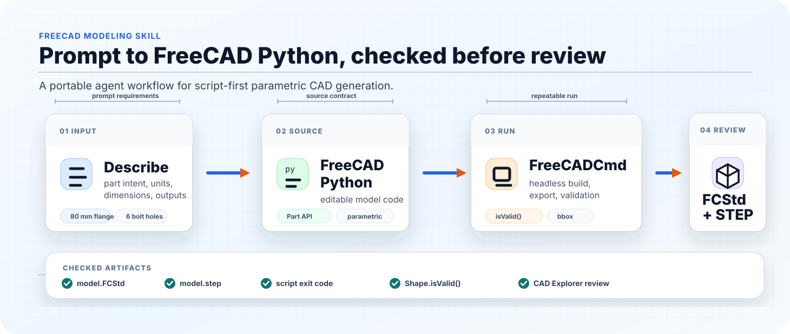

# FreeCAD Modeling Skill

Turn natural-language CAD ideas into **FreeCAD Python source**, then run, export,
validate, and preview the result.



## ✨ What Is This?

`freecad-modeling` is an agent skill for workflows where the CAD source of truth
should be **FreeCAD Python**, not a one-off exported mesh.

Give your AI coding agent a model request, and the skill guides it to:

- write parameterized FreeCAD Python code,
- run the code with `FreeCADCmd`,
- export `.FCStd` and `.step` files,
- validate the generated shape,
- hand the STEP file to CAD Explorer or another CAD viewer for review.

It is useful for mechanical parts, fixtures, housings, brackets, flanges,
enclosures, FreeCAD macros, and project workflows that need editable FreeCAD
source code.

## ⚡ Quick Example

```text
Use $freecad-modeling to create an 80 mm round flange with a 30 mm center bore
and six 6 mm bolt holes. Save the FreeCAD Python source, export FCStd and STEP,
and open the STEP in CAD Explorer.
```

Expected outputs:

```text
model.py      # FreeCAD Python source of truth
model.FCStd   # native FreeCAD document
model.step    # exchange/review file
```

## 🧭 Workflow

```text
Prompt
  -> FreeCAD Python
  -> FreeCADCmd
  -> FCStd / STEP
  -> geometry validation
  -> CAD Explorer review
```

The skill keeps the Python file as the editable model source. Generated `.FCStd`,
`.step`, and optional `.stl` files are derived artifacts that can be regenerated.

## 🤖 Supported Agents

The skill itself is a normal folder with a `SKILL.md` entrypoint, plus scripts and
reference files. The installer supports common agent skill directories:

| Agent | Install target |
| --- | --- |
| OpenAI Codex | `${CODEX_HOME:-~/.codex}/skills/freecad-modeling` |
| Claude Code | `${CLAUDE_SKILLS_DIR:-~/.claude/skills}/freecad-modeling` |
| Gemini CLI | `${GEMINI_SKILLS_DIR:-.gemini/skills}/freecad-modeling` |
| OpenClaw | `${OPENCLAW_SKILLS_DIR:-~/.openclaw/skills}/freecad-modeling` |
| Cursor | `${CURSOR_SKILLS_DIR:-.cursor/skills}/freecad-modeling` |
| VS Code / Copilot-style project skills | `${VSCODE_SKILLS_DIR:-.github/skills}/freecad-modeling` |
| Goose | `${GOOSE_SKILLS_DIR:-~/.config/goose/skills}/freecad-modeling` |
| Generic project-local skill | `${PROJECT_SKILLS_DIR:-.skills}/freecad-modeling` |

Different agents may vary in how they discover and invoke skills. The files here
are intentionally plain-text and portable so they can be copied into the skill
directory your agent expects.

## 📦 Installation

Clone once:

```bash
git clone https://github.com/ranranjiang666/freecad-modeling.git
cd freecad-modeling
```

Install for Codex:

```bash
./scripts/codex-install.sh
```

Install for Claude Code:

```bash
./scripts/claude-install.sh
```

Install for Gemini CLI:

```bash
./scripts/gemini-install.sh
```

Install for OpenClaw:

```bash
./scripts/openclaw-install.sh
```

Use the shared installer for other targets:

```bash
python scripts/install-skill.py --agent cursor
python scripts/install-skill.py --agent vscode
python scripts/install-skill.py --agent goose
python scripts/install-skill.py --agent project
python scripts/install-skill.py --agent all --dry-run
```

Options:

```text
--dry-run   preview install actions
--force     replace an existing installed copy
--link      symlink instead of copying
```

Restart your agent after installing or updating the skill.

## 🛠️ FreeCAD Requirement

This skill expects a local FreeCAD installation with `FreeCADCmd`.

The runner checks for FreeCADCmd in this order:

1. `--freecadcmd <path>`
2. `FREECADCMD`, `FREECAD_CMD`, or `FREECADCMD_PATH`
3. `FreeCADCmd` / `freecadcmd` on `PATH`
4. common Windows install locations, including:

```text
E:\FreeCAD\bin\freecadcmd.exe
```

For a portable setup, prefer an environment variable:

```bash
export FREECADCMD="/path/to/FreeCADCmd"
```

On Windows PowerShell:

```powershell
$env:FREECADCMD = "E:\FreeCAD\bin\freecadcmd.exe"
```

## 🚀 Runner

The runner is useful when an agent needs to execute a FreeCAD script in the
background:

```bash
python scripts/run_freecad.py path/to/model.py --json
```

With an explicit FreeCADCmd path:

```bash
python scripts/run_freecad.py path/to/model.py --freecadcmd "E:/FreeCAD/bin/freecadcmd.exe" --json
```

Forward arguments to the model script after `--`:

```bash
python scripts/run_freecad.py path/to/model.py -- --output-dir out
```

The runner uses a small `runpy` bootstrap because some FreeCADCmd builds open an
interactive console instead of executing a `.py` file passed as a plain positional
argument.

## 🧱 Modeling Style

The skill defaults to FreeCAD's `Part` API for robust command-line generation:

- primitives such as `Part.makeBox` and `Part.makeCylinder`,
- booleans such as `fuse`, `cut`, and `common`,
- cleanup with `removeSplitter`,
- fillets, chamfers, wires, faces, extrudes, and revolves.

Use Sketcher or PartDesign when editable FreeCAD feature-tree behavior is a
specific requirement.

## 📁 Repository Layout

```text
freecad-modeling/
  SKILL.md
  README.md
  agents/
    openai.yaml
  assets/
    freecad-modeling-flow.svg
  scripts/
    run_freecad.py
    install-skill.py
    codex-install.sh
    claude-install.sh
    gemini-install.sh
    openclaw-install.sh
    install.sh
  references/
    source-contract.md
    part-api-patterns.md
    export-and-validation.md
    repair-loop.md
```

## 🚧 What This Does Not Do

This skill helps create and validate CAD geometry, but it does not certify:

- manufacturing readiness,
- structural strength,
- tolerance compliance,
- safety or regulatory suitability.

Use engineering review and domain-specific checks for those decisions.
